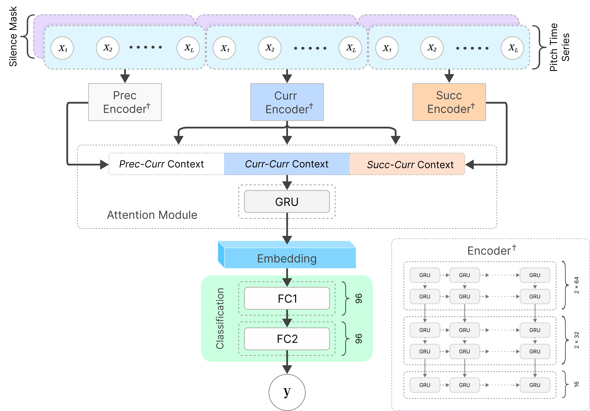

# ContextGRU

Context-aware GRU model for improved svara representation in Carnatic music, accompanying **“Leveraging Melodic Context for Improved Svara Representation”** (CMMR 2025).



## Setup

```bash
git clone https://github.com/vivekvjyn/ContextGRU.git
cd ContextGRU
pip install -e .
```

Place the preprocessed Bhairavi data in `data/bhairavi/` as `TRAIN.pkl` and `TEST.pkl`.

## Ablation

Run the four context/target experiments:

```bash
./run.sh ablation
```

The aggregate results are written to:

```text
results/ablation.csv
```

The table reports mean and standard-deviation F1 for svara and svara-form classification, with and without melodic context.

## Analysis

Run the encoder contribution analysis using a saved context model checkpoint:

```bash
./run.sh analysis \
  --checkpoint runs/context-model/best_model_fold=0.pt
```

The aggregate analysis table is written to:

```text
results/analysis.csv
```

The table reports normalized gradient contributions for the preceding, current, and succeeding encoders.
